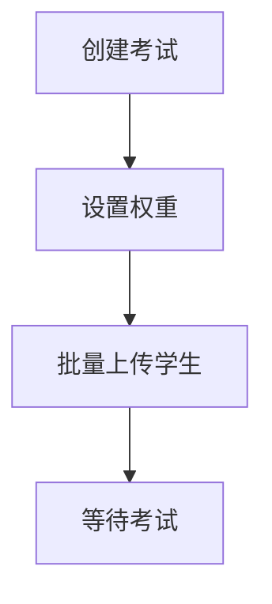
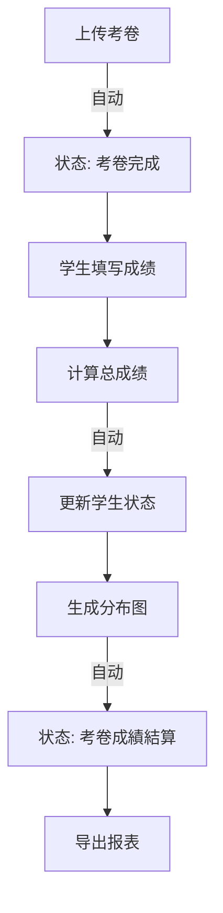
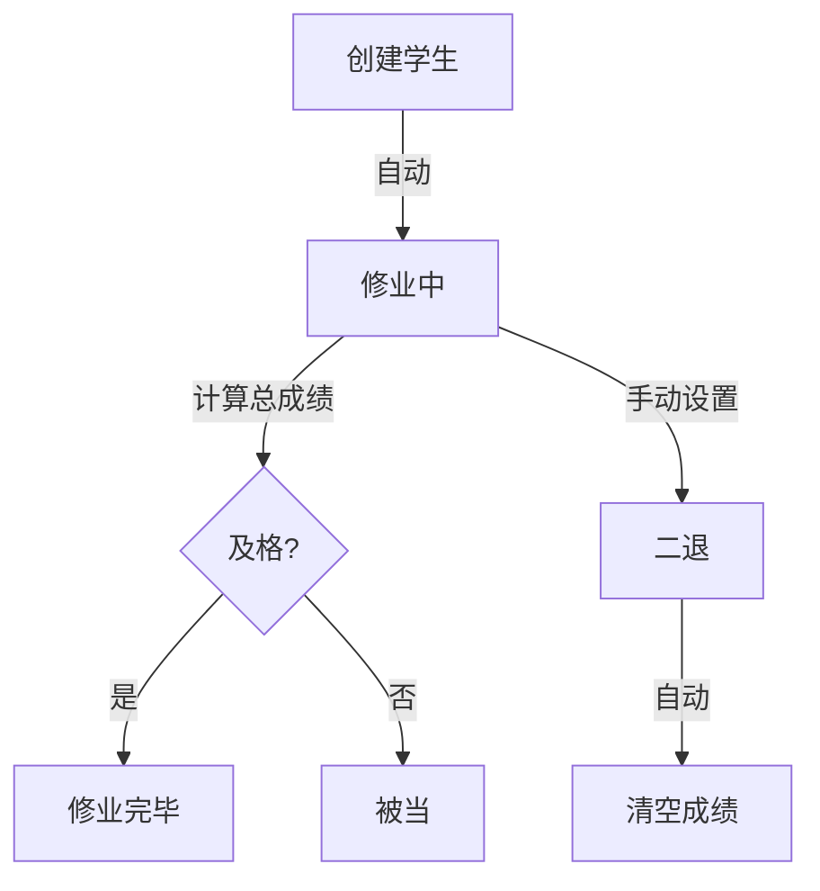

# Calculus_oom 前端 API 需求文档

**后端基础 URL**: `http://localhost:8000/api/v0.1/Calculus_oom/Calculus_metadata`

---

## 目录

1. [系统概述](#1-系统概述)
2. [学生管理模块](#2-学生管理模块)
3. [成绩管理模块](#3-成绩管理模块)
4. [考试管理模块](#4-考试管理模块)
5. [文件管理模块](#5-文件管理模块)
6. [完整工作流程](#6-完整工作流程)
7. [前端页面建议](#7-前端页面建议)

---

## 1. 系统概述

### 1.1 架构说明

- **SQL Database**: 学生、成绩、考试元数据（PostgreSQL）
- **NoSQL Database**: 考卷图片、直方图文件（MongoDB）
- **自动化特性**: 状态自动更新、文件自动上传

### 1.2 通用响应格式

#### 成功响应
```json
{
  "detail": "操作描述",
  "data": { /* 数据对象 */ }
}
```

#### 错误响应
```json
{
  "detail": "错误描述",
  "data": null
}
```

### 1.3 HTTP 方法
所有 API 统一使用 **POST** 方法

---

## 2. 学生管理模块

### 2.1 创建学生

#### API 信息
- **URL**: `POST /Student_MetadataWriter/create`
- **完整路径**: `http://localhost:8000/api/v0.1/Calculus_oom/Calculus_metadata/Student_MetadataWriter/create`

#### 请求参数（用户填写）
```json
{
  "student_name": "张三",
  "student_number": "B11001001",
  "student_semester": "1141"
}
```

| 字段 | 类型 | 必填 | 说明 | 前端组件 |
|------|------|------|------|----------|
| student_name | string | ✅ | 学生姓名 | Input |
| student_number | string | ✅ | 学号 | Input |
| student_semester | string | ✅ | 学期 (格式: 1141) | Input/Select |

#### 响应数据（前端显示）
```json
{
  "detail": "Student created successfully",
  "data": {
    "id": 1,
    "student_uuid": "stu_1141_0105_abc12345",
    "student_name": "张三",
    "student_number": "B11001001",
    "student_semester": "1141",
    "student_status": "修业中",
    "student_created_at": "2026-01-05 10:30:00",
    "student_updated_at": "2026-01-05 10:30:00"
  }
}
```

#### 前端显示需求
- ✅ 显示创建成功消息
- ✅ 显示学生状态徽章：`修业中`（绿色）
- ✅ 自动刷新学生列表

#### 自动执行
- 🤖 自动生成 `student_uuid`
- 🤖 自动创建对应的成绩记录（初始为空）
- 🤖 自动设置状态为 `修业中`

---

### 2.2 批量上传学生（Excel）

#### API 信息
- **URL**: `POST /Student_MetadataWriter/upload_excel`
- **完整路径**: `http://localhost:8000/api/v0.1/Calculus_oom/Calculus_metadata/Student_MetadataWriter/upload_excel`

#### 请求参数（用户填写）
```javascript
// FormData 格式
const formData = new FormData();
formData.append('file', excelFile);  // .xlsx 文件
```

#### Excel 文件格式
| 姓名 | 学号 | 学期 |
|------|------|------|
| 张三 | B11001001 | 1141 |
| 李四 | B11001002 | 1141 |

#### 响应数据（前端显示）
```json
{
  "detail": "Successfully created 50 students with 2 errors",
  "data": {
    "created_count": 50,
    "error_count": 2,
    "created_students": ["stu_1141_...", "stu_1141_..."],
    "errors": [
      "Row 5: 必要栏位为空",
      "Row 10: Validation failed"
    ]
  }
}
```

#### 前端显示需求
- ✅ 文件上传组件（限制 .xlsx 格式）
- ✅ 上传进度条
- ✅ 成功/失败统计
- ✅ 错误列表展示（如有）
- ✅ 下载 Excel 模板按钮

#### 前端交互
```javascript
// 1. 提供模板下载
downloadTemplate() {
  // 创建包含标题行的 Excel 模板
  const template = [['姓名', '学号', '学期']];
  // ... 导出为 .xlsx
}

// 2. 上传 Excel
async uploadStudents(file) {
  const formData = new FormData();
  formData.append('file', file);
  
  const response = await fetch(url, {
    method: 'POST',
    body: formData
  });
  
  // 显示结果
  if (response.data.error_count > 0) {
    showErrorModal(response.data.errors);
  }
  showSuccessMessage(`成功创建 ${response.data.created_count} 位学生`);
}
```

---

### 2.3 查询学生

#### API 信息
- **URL**: `POST /Student_MetadataWriter/read`
- **完整路径**: `http://localhost:8000/api/v0.1/Calculus_oom/Calculus_metadata/Student_MetadataWriter/read`

#### 请求参数（用户填写）

**查询单个学生**:
```json
{
  "student_uuid": "stu_1141_0105_abc12345"
}
```

**查询列表（带筛选）**:
```json
{
  "student_semester": "1141",
  "student_status": "修业中"
}
```

**查询全部**:
```json
{}
```

| 字段 | 类型 | 必填 | 说明 | 前端组件 |
|------|------|------|------|----------|
| student_uuid | string | ❌ | 学生UUID（单查） | - |
| student_semester | string | ❌ | 学期筛选 | Select |
| student_status | string | ❌ | 状态筛选 | Select |

#### 响应数据（前端显示）
```json
{
  "detail": "Students retrieved successfully",
  "data": [
    {
      "id": 1,
      "student_uuid": "stu_1141_0105_abc12345",
      "student_name": "张三",
      "student_number": "B11001001",
      "student_semester": "1141",
      "student_status": "修业中",
      "student_created_at": "2026-01-05 10:30:00",
      "student_updated_at": "2026-01-05 10:30:00"
    }
  ]
}
```

#### 前端显示需求
- ✅ 学生列表表格（可排序、分页）
- ✅ 状态徽章：
  - `修业中` - 蓝色
  - `修业完毕` - 绿色
  - `被当` - 红色
  - `二退` - 灰色
- ✅ 筛选器：学期、状态
- ✅ 搜索框：姓名、学号

---

### 2.4 更新学生信息

#### API 信息
- **URL**: `POST /Student_MetadataWriter/update`
- **完整路径**: `http://localhost:8000/api/v0.1/Calculus_oom/Calculus_metadata/Student_MetadataWriter/update`

#### 请求参数（用户填写）
```json
{
  "student_uuid": "stu_1141_0105_abc12345",
  "student_name": "张三",
  "student_number": "B11001001",
  "student_semester": "1141"
}
```

#### 前端显示需求
- ✅ 编辑表单（预填现有数据）
- ✅ 保存按钮
- ✅ 取消按钮

---

### 2.5 删除学生

#### API 信息
- **URL**: `POST /Student_MetadataWriter/delete`
- **完整路径**: `http://localhost:8000/api/v0.1/Calculus_oom/Calculus_metadata/Student_MetadataWriter/delete`

#### 请求参数（用户填写）
```json
{
  "student_uuid": "stu_1141_0105_abc12345"
}
```

#### 前端显示需求
- ✅ 删除确认对话框
- ⚠️ 警告提示：将同时删除关联的成绩记录

#### 自动执行
- 🤖 自动删除所有关联的成绩记录（Cascade Delete）

---

### 2.6 更新学生状态

#### API 信息
- **URL**: `POST /Student_MetadataWriter/status`
- **完整路径**: `http://localhost:8000/api/v0.1/Calculus_oom/Calculus_metadata/Student_MetadataWriter/status`

#### 请求参数（用户填写）
```json
{
  "student_uuid": "stu_1141_0105_abc12345",
  "student_status": "二退"
}
```

| 字段 | 类型 | 必填 | 可选值 | 前端组件 |
|------|------|------|--------|----------|
| student_uuid | string | ✅ | - | - |
| student_status | string | ✅ | 修业中, 二退, 被当, 修业完毕 | Select |

#### 前端显示需求
- ✅ 状态下拉选择器
- ⚠️ **特别提示**：设置为 `二退` 将清空该学生所有成绩

#### 自动执行
- 🤖 若设置为 `二退`，自动清空该学生所有成绩
- 🤖 `修业完毕`/`被当` 通常由系统自动设置（计算总成绩时）

---

### 2.7 导出学生成绩（Excel）

#### API 信息
- **URL**: `POST /Student_MetadataWriter/feedback_excel`
- **完整路径**: `http://localhost:8000/api/v0.1/Calculus_oom/Calculus_metadata/Student_MetadataWriter/feedback_excel`

#### 请求参数（用户填写）
```json
{
  "student_semester": "1141"
}
```

#### 响应
- **Content-Type**: `application/vnd.openxmlformats-officedocument.spreadsheetml.sheet`
- **文件名**: `students_scores_1141.xlsx`

#### 导出内容
| 学号 | 姓名 | 学期 | 状态 | 第一次小考 | 期中考 | 第二次小考 | 期末考 | 总分 |
|------|------|------|------|-----------|--------|-----------|--------|------|
| B11001001 | 张三 | 1141 | 修业完毕 | 85 | 90 | 88 | 92 | 89.2 |

#### 前端显示需求
- ✅ 导出按钮
- ✅ 学期选择器
- ✅ 自动下载文件

---

## 3. 成绩管理模块

### 3.1 创建/更新成绩

#### API 信息
- **URL**: `POST /Score_MetadataWriter/create`
- **完整路径**: `http://localhost:8000/api/v0.1/Calculus_oom/Calculus_metadata/Score_MetadataWriter/create`

#### 请求参数（用户填写）
```json
{
  "f_student_uuid": "stu_1141_0105_abc12345",
  "update_field": "score_quiz1",
  "score_value": 85
}
```

| 字段 | 类型 | 必填 | 可选值 | 前端组件 |
|------|------|------|--------|----------|
| f_student_uuid | string | ✅ | - | Hidden |
| update_field | string | ✅ | score_quiz1, score_midterm, score_quiz2, score_finalexam | Select |
| score_value | number | ✅ | 0-100 | Input (number) |

#### 前端显示需求
- ✅ 成绩输入表格（可编辑）
- ✅ 数值验证（0-100）
- ✅ 自动保存或保存按钮

---

### 3.2 更新成绩

#### API 信息
- **URL**: `POST /Score_MetadataWriter/update`
- **完整路径**: `http://localhost:8000/api/v0.1/Calculus_oom/Calculus_metadata/Score_MetadataWriter/update`

#### 请求参数（用户填写）
```json
{
  "score_uuid": "scr_1141_0105_xyz67890",
  "update_field": "score_quiz1",
  "score_value": 88
}
```

---

### 3.3 查询成绩

#### API 信息
- **URL**: `POST /Score_MetadataWriter/read`
- **完整路径**: `http://localhost:8000/api/v0.1/Calculus_oom/Calculus_metadata/Score_MetadataWriter/read`

#### 请求参数（用户填写）
```json
{
  "f_student_uuid": "stu_1141_0105_abc12345"
}
```

#### 响应数据（前端显示）
```json
{
  "detail": "Score retrieved successfully",
  "data": {
    "id": 1,
    "score_uuid": "scr_1141_0105_xyz67890",
    "score_quiz1": "85",
    "score_midterm": "90",
    "score_quiz2": "88",
    "score_finalexam": "92",
    "score_total": "89.2",
    "f_student_uuid": "stu_1141_0105_abc12345",
    "score_created_at": "2026-01-05 10:30:00",
    "score_updated_at": "2026-01-05 15:20:00"
  }
}
```

#### 前端显示需求
- ✅ 成绩表格（显示所有考试）
- ✅ 总分高亮显示
- ✅ 空白成绩显示为 "-" 或 "未填写"

---

### 3.4 计算总成绩

#### API 信息
- **URL**: `POST /Score_MetadataWriter/calculation_final`
- **完整路径**: `http://localhost:8000/api/v0.1/Calculus_oom/Calculus_metadata/Score_MetadataWriter/calculation_final`

#### 请求参数（用户填写）
```json
{
  "test_semester": "1141",
  "passing_score": 60.0
}
```

| 字段 | 类型 | 必填 | 说明 | 前端组件 |
|------|------|------|------|----------|
| test_semester | string | ✅ | 学期 | Select |
| passing_score | number | ✅ | 及格分数 | Input (默认 60) |

#### 响应数据
```json
{
  "detail": "Final scores calculated successfully for 50 students",
  "data": {
    "updated_count": 50
  }
}
```

#### 前端显示需求
- ✅ 计算按钮（带确认）
- ✅ 及格分数输入框
- ✅ 成功后显示更新数量

#### 自动执行 🤖
- 🤖 自动计算加权总分（根据权重配置）
- 🤖 自动更新学生状态：
  - 总分 >= 及格分数 → `修业完毕`
  - 总分 < 及格分数 → `被当`

---

### 3.5 考试统计

#### API 信息
- **URL**: `POST /Score_MetadataWriter/test_score`
- **完整路径**: `http://localhost:8000/api/v0.1/Calculus_oom/Calculus_metadata/Score_MetadataWriter/test_score`

#### 请求参数（用户填写）
```json
{
  "score_semester": "1141",
  "score_field": "score_midterm",
  "exclude_empty": true
}
```

#### 响应数据（前端显示）
```json
{
  "detail": "Test statistics calculated successfully",
  "data": {
    "semester": "1141",
    "score_field": "score_midterm",
    "total_count": 48,
    "average": 78.5,
    "median": 80.0
  }
}
```

#### 前端显示需求
- ✅ 统计卡片：
  - 📊 参与人数
  - 📈 平均分
  - 📊 中位数
- ✅ 考试选择器
- ✅ 是否排除空白成绩的开关

---

### 3.6 生成成绩分布图

#### API 信息
- **URL**: `POST /Score_MetadataWriter/step_diagram`
- **完整路径**: `http://localhost:8000/api/v0.1/Calculus_oom/Calculus_metadata/Score_MetadataWriter/step_diagram`

#### 请求参数（用户填写）
```json
{
  "test_semester": "1141",
  "score_field": "score_midterm",
  "bins": {
    "type": "fixed_width",
    "width": 10
  },
  "title": "1141 期中考 分数分布",
  "format": "png"
}
```

| 字段 | 类型 | 必填 | 说明 | 前端组件 |
|------|------|------|------|----------|
| test_semester | string | ✅ | 学期 | Select |
| score_field | string | ✅ | 考试类型 | Select |
| bins.width | number | ❌ | 级距宽度（默认10） | Input |
| title | string | ❌ | 图表标题 | Input |
| format | string | ❌ | 格式（png/jpg） | Select |

#### 响应
- **Content-Type**: `image/png` 或 `image/jpeg`
- **返回图片文件**

#### 前端显示需求
- ✅ 生成按钮
- ✅ 图片预览/下载
- ✅ 标题自定义输入

#### 自动执行 🤖
- 🤖 生成后自动上传到文件系统
- 🤖 自动关联到对应考试
- 🤖 自动更新考试状态为 `考卷成績結算`

---

## 4. 考试管理模块

### 4.1 创建考试

#### API 信息
- **URL**: `POST /Test_MetadataWriter/create`
- **完整路径**: `http://localhost:8000/api/v0.1/Calculus_oom/Calculus_metadata/Test_MetadataWriter/create`

#### 请求参数（用户填写）
```json
{
  "test_name": "期中考",
  "test_date": "114/12/28",
  "test_range": "1-1~2-6",
  "test_semester": "1141"
}
```

| 字段 | 类型 | 必填 | 说明 | 前端组件 |
|------|------|------|------|----------|
| test_name | string | ✅ | 考试名称 | Input |
| test_date | string | ✅ | 考试日期 | DatePicker |
| test_range | string | ✅ | 考试范围 | Input |
| test_semester | string | ✅ | 学期 | Select |

#### 响应数据（前端显示）
```json
{
  "detail": "Test created successfully",
  "data": {
    "id": 1,
    "test_uuid": "tst_1141_q1_abc12345",
    "test_name": "期中考",
    "test_date": "114/12/28",
    "test_range": "1-1~2-6",
    "test_semester": "1141",
    "test_weight": "",
    "test_states": "尚未出考卷",
    "pt_opt_score_uuid": "",
    "test_created_at": "2026-01-05 10:30:00",
    "test_updated_at": "2026-01-05 10:30:00"
  }
}
```

#### 前端显示需求
- ✅ 考试状态徽章：
  - `尚未出考卷` - 灰色
  - `考卷完成` - 蓝色
  - `考卷成績結算` - 绿色

#### 自动执行
- 🤖 自动设置初始状态为 `尚未出考卷`

---

### 4.2 查询考试

#### API 信息
- **URL**: `POST /Test_MetadataWriter/read`
- **完整路径**: `http://localhost:8000/api/v0.1/Calculus_oom/Calculus_metadata/Test_MetadataWriter/read`

#### 请求参数
```json
{
  "test_semester": "1141"
}
```

#### 前端显示需求
- ✅ 考试列表卡片
- ✅ 显示考试名称、日期、范围
- ✅ 状态徽章
- ✅ 权重显示（如已设置）

---

### 4.3 更新考试状态（手动）

#### API 信息
- **URL**: `POST /Test_MetadataWriter/status`
- **完整路径**: `http://localhost:8000/api/v0.1/Calculus_oom/Calculus_metadata/Test_MetadataWriter/status`

#### 请求参数（用户填写）
```json
{
  "test_uuid": "tst_1141_mid_abc12345",
  "status": "考卷完成"
}
```

| 字段 | 类型 | 必填 | 可选值 |
|------|------|------|--------|
| test_uuid | string | ✅ | - |
| status | string | ✅ | 尚未出考卷, 考卷完成, 考卷成績結算 |

#### 前端显示需求
- ✅ 状态下拉选择器
- ℹ️ **注意**：通常由系统自动更新，手动调用用于补救

---

### 4.4 设置权重

#### API 信息
- **URL**: `POST /Test_MetadataWriter/setweight`
- **完整路径**: `http://localhost:8000/api/v0.1/Calculus_oom/Calculus_metadata/Test_MetadataWriter/setweight`

#### 请求参数（用户填写）
```json
{
  "test_semester": "1141",
  "weights": {
    "第一次小考": 0.2,
    "期中考": 0.3,
    "第二次小考": 0.2,
    "期末考": 0.3
  }
}
```

#### 前端显示需求
- ✅ 权重配置表单
- ✅ 总和验证（必须等于 1.0）
- ✅ 百分比显示（20%, 30%, ...）

#### 前端组件示例
```javascript
const weightConfig = {
  '第一次小考': 0.2,
  '期中考': 0.3,
  '第二次小考': 0.2,
  '期末考': 0.3
};

// 验证总和
const sum = Object.values(weightConfig).reduce((a, b) => a + b, 0);
if (Math.abs(sum - 1.0) > 0.001) {
  alert('权重总和必须为 100%');
}
```

---

## 5. 文件管理模块

### 5.1 上传考卷

#### API 信息
- **URL**: `POST /test-filedata/create`
- **完整路径**: `http://localhost:8000/api/v0.1/Calculus_oom/Calculus_metadata/test-filedata/create`

#### 请求参数（用户填写）
```javascript
// FormData 格式
const formData = new FormData();
formData.append('test_uuid', 'tst_1141_mid_abc12345');
formData.append('asset_type', 'paper');
formData.append('file', imageFile);  // 图片文件
```

| 字段 | 类型 | 必填 | 可选值 |
|------|------|------|--------|
| test_uuid | string | ✅ | - |
| asset_type | string | ✅ | paper, test_pic, histogram, test_pic_histogram |
| file | File | ✅ | 图片文件 |

#### 响应数据
```json
{
  "detail": "Files uploaded successfully",
  "data": {
    "file_uuid": "tpic_1141_mid_abc12345",
    "asset_type": "paper",
    "file_count": 1,
    "mongodb_id": "...",
    "test_states": "考卷完成"
  }
}
```

#### 前端显示需求
- ✅ 文件上传组件（支持拖放）
- ✅ 图片预览
- ✅ 上传进度条
- ✅ 支持的格式：JPG, PNG

#### 自动执行 🤖
- 🤖 上传 `paper` 时，自动更新状态：`尚未出考卷` → `考卷完成`
- 🤖 上传 `histogram` 时，自动更新状态：`考卷完成` → `考卷成績結算`

---

### 5.2 查看考卷

#### API 信息
- **URL**: `POST /test-filedata/read`
- **完整路径**: `http://localhost:8000/api/v0.1/Calculus_oom/Calculus_metadata/test-filedata/read`

#### 请求参数
```json
{
  "test_pic_uuid": "tpic_1141_mid_abc12345",
  "asset_type": "paper"
}
```

#### 响应
- **Content-Type**: `image/jpeg` 或 `image/png`
- **返回图片文件**

#### 前端显示需求
- ✅ 图片查看器/灯箱
- ✅ 缩放、旋转功能
- ✅ 下载按钮

---

### 5.3 更新考卷

#### API 信息
- **URL**: `POST /test-filedata/update`
- **完整路径**: `http://localhost:8000/api/v0.1/Calculus_oom/Calculus_metadata/test-filedata/update`

#### 请求参数
```javascript
const formData = new FormData();
formData.append('uid', 'tpic_1141_mid_abc12345');
formData.append('asset_type', 'paper');
formData.append('file', newImageFile);
```

---

### 5.4 删除考卷

#### API 信息
- **URL**: `POST /test-filedata/delete`
- **完整路径**: `http://localhost:8000/api/v0.1/Calculus_oom/Calculus_metadata/test-filedata/delete`

#### 请求参数
```json
{
  "test_pic_uuid": "tpic_1141_mid_abc12345",
  "asset_type": "paper"
}
```

#### 前端显示需求
- ✅ 删除确认对话框

---

## 6. 完整工作流程

### 6.1 学期初始化流程



#### 前端操作步骤
1. **创建考试**
   - 点击"新建考试"
   - 填写考试信息
   - API: `Test_MetadataWriter/create`

2. **设置权重**
   - 进入"权重配置"
   - 设置各考试权重
   - API: `Test_MetadataWriter/setweight`

3. **批量上传学生**
   - 下载模板
   - 填写学生信息
   - 上传 Excel
   - API: `Student_MetadataWriter/upload_excel`

---

### 6.2 考试发布流程



#### 前端操作步骤
1. **上传考卷**
   - 选择考试
   - 上传图片
   - API: `test-filedata/create` (asset_type: paper)
   - 🤖 状态自动变为 `考卷完成`

2. **填写成绩**
   - 在成绩表格中输入分数
   - API: `Score_MetadataWriter/create` 或 `update`

3. **计算总成绩**
   - 点击"计算总成绩"
   - 设置及格分数
   - API: `Score_MetadataWriter/calculation_final`
   - 🤖 学生状态自动更新

4. **生成分布图**
   - 点击"生成分布图"
   - 选择考试类型
   - API: `Score_MetadataWriter/step_diagram`
   - 🤖 自动上传 + 状态自动变为 `考卷成績結算`

5. **导出报表**
   - 点击"导出报表"
   - API: `Student_MetadataWriter/feedback_excel`

---

### 6.3 学生状态流转



---

## 7. 前端页面建议

### 7.1 页面结构

```
├── Dashboard（仪表板）
│   ├── 统计概览
│   └── 快速操作
├── Students（学生管理）
│   ├── 学生列表
│   ├── 批量上传
│   └── 导出报表
├── Scores（成绩管理）
│   ├── 成绩录入
│   ├── 成绩查询
│   └── 统计分析
├── Tests（考试管理）
│   ├── 考试列表
│   ├── 权重配置
│   └── 考卷管理
└── Reports（报表中心）
    ├── 成绩分布图
    └── 导出功能
```

---

### 7.2 Dashboard（仪表板）

#### 显示内容
- 📊 **统计卡片**
  - 总学生数
  - 本学期考试数
  - 待处理任务
  
- 📈 **快速操作**
  - 批量上传学生
  - 创建考试
  - 导出报表

#### API 调用
- 学生总数：`Student_MetadataWriter/read` (空参数)
- 考试列表：`Test_MetadataWriter/read`

---

### 7.3 Students（学生管理）页面

#### 功能组件
1. **学生列表**
   - 数据表格（可排序、分页）
   - 筛选器：学期、状态
   - 操作按钮：编辑、删除、设置状态

2. **批量上传**
   - 下载模板按钮
   - 文件上传组件
   - 上传结果展示

3. **导出报表**
   - 学期选择器
   - 导出按钮

#### 页面布局
```
┌─────────────────────────────────────────┐
│  学生管理                    [+ 新增学生] │
├─────────────────────────────────────────┤
│  筛选：[学期▾] [状态▾]  🔍 搜索           │
├─────────────────────────────────────────┤
│  ┌─ 操作栏 ──────────────────────────┐  │
│  │ [📤 批量上传] [📥 导出报表]        │  │
│  └───────────────────────────────────┘  │
├─────────────────────────────────────────┤
│  学号      姓名    学期   状态      操作  │
│  ─────────────────────────────────────  │
│  B110... 张三   1141   [修业中]   [编辑] │
│  B110... 李四   1141   [修业完毕] [编辑] │
└─────────────────────────────────────────┘
```

---

### 7.4 Scores（成绩管理）页面

#### 功能组件
1. **成绩录入表格**
   - 学生列表
   - 可编辑单元格
   - 自动保存或批量保存

2. **成绩查询**
   - 学生搜索
   - 成绩明细

3. **统计分析**
   - 考试选择器
   - 统计卡片（平均分、中位数）
   - 分布图生成

#### 页面布局
```
┌─────────────────────────────────────────┐
│  成绩管理            [计算总成绩]          │
├─────────────────────────────────────────┤
│  学期：[1141▾]  考试：[期中考▾]           │
├─────────────────────────────────────────┤
│  学号     姓名  小考1  期中  小考2  期末  总分│
│  ────────────────────────────────────── │
│  B110... 张三   85    90    88    92   89.2│
│  B110... 李四   78    82    -     -     -  │
├─────────────────────────────────────────┤
│  统计信息                                  │
│  ┌─ 平均分 ──┐ ┌─ 中位数 ──┐             │
│  │   85.5   │ │   87.0   │             │
│  └──────────┘ └──────────┘             │
│  [生成分布图]                             │
└─────────────────────────────────────────┘
```

---

### 7.5 Tests（考试管理）页面

#### 功能组件
1. **考试列表**
   - 考试卡片
   - 状态显示
   - 操作按钮

2. **权重配置**
   - 权重设置表单
   - 百分比显示
   - 总和验证

3. **考卷管理**
   - 上传考卷
   - 查看/下载
   - 直方图管理

#### 页面布局
```
┌─────────────────────────────────────────┐
│  考试管理                    [+ 新建考试] │
├─────────────────────────────────────────┤
│  学期：[1141▾]                           │
├─────────────────────────────────────────┤
│  ┌─ 期中考 ─────────────────────┐       │
│  │ 日期：114/12/28              │       │
│  │ 范围：1-1~2-6                │       │
│  │ 状态：[考卷完成]             │       │
│  │ 权重：30%                    │       │
│  │ [上传考卷] [查看考卷] [编辑] │       │
│  └─────────────────────────────┘       │
│  ┌─ 期末考 ─────────────────────┐       │
│  │ ...                          │       │
│  └─────────────────────────────┘       │
└─────────────────────────────────────────┘
```

---

### 7.6 状态徽章样式建议

```css
/* 学生状态 */
.badge-active { background: #3b82f6; }      /* 修业中 - 蓝色 */
.badge-completed { background: #10b981; }   /* 修业完毕 - 绿色 */
.badge-failed { background: #ef4444; }      /* 被当 - 红色 */
.badge-withdrew { background: #6b7280; }    /* 二退 - 灰色 */

/* 考试状态 */
.badge-pending { background: #9ca3af; }     /* 尚未出考卷 - 灰色 */
.badge-ready { background: #3b82f6; }       /* 考卷完成 - 蓝色 */
.badge-finished { background: #10b981; }    /* 考卷成績結算 - 绿色 */
```

---

## 8. 前端开发注意事项

### 8.1 API 调用约定

#### 统一错误处理
```javascript
async function callAPI(url, data) {
  try {
    const response = await fetch(url, {
      method: 'POST',
      headers: {
        'Content-Type': 'application/json',
      },
      body: JSON.stringify(data)
    });
    
    const result = await response.json();
    
    if (response.ok) {
      return { success: true, data: result.data };
    } else {
      return { success: false, error: result.detail };
    }
  } catch (error) {
    return { success: false, error: error.message };
  }
}
```

#### 文件上传
```javascript
async function uploadFile(url, formData) {
  try {
    const response = await fetch(url, {
      method: 'POST',
      body: formData  // 不要设置 Content-Type
    });
    
    if (response.headers.get('content-type')?.includes('application/json')) {
      return await response.json();
    } else {
      // 图片或 Excel 文件
      return await response.blob();
    }
  } catch (error) {
    console.error('Upload failed:', error);
  }
}
```

---

### 8.2 自动化流程提示

#### 状态自动更新
以下操作会自动更新状态，前端应在操作后刷新数据：

1. **上传考卷** → 考试状态自动变为 `考卷完成`
2. **生成分布图** → 考试状态自动变为 `考卷成績結算`
3. **计算总成绩** → 学生状态自动变为 `修业完毕`/`被当`
4. **设置二退** → 成绩自动清空

#### 前端刷新策略
```javascript
// 操作完成后刷新
async function uploadPaper(testId, file) {
  const result = await uploadFile(uploadUrl, formData);
  
  if (result.success) {
    // 显示新状态
    updateTestStatus(result.data.test_states);
    
    // 可选：显示提示
    showToast(`考卷上传成功，状态已更新为 ${result.data.test_states}`);
  }
}
```

---

### 8.3 数据验证

#### 前端验证规则
```javascript
const validationRules = {
  // 学号格式
  student_number: /^[A-Z]\d{8}$/,
  
  // 学期格式
  semester: /^\d{4}$/,
  
  // 成绩范围
  score: (value) => value >= 0 && value <= 100,
  
  // 权重总和
  weights: (weights) => {
    const sum = Object.values(weights).reduce((a, b) => a + b, 0);
    return Math.abs(sum - 1.0) < 0.001;
  }
};
```

---

### 8.4 性能优化建议

1. **分页加载**
   - 学生列表使用分页（每页 50 条）
   - 考试列表按学期筛选

2. **防抖处理**
   - 成绩输入使用防抖（500ms）
   - 搜索框使用防抖（300ms）

3. **批量操作**
   - 成绩录入支持批量保存
   - 避免逐条更新

---

## 9. 测试建议

### 9.1 功能测试清单

#### 学生管理
- [ ] 创建单个学生
- [ ] 批量上传学生（正常文件）
- [ ] 批量上传学生（错误文件）
- [ ] 查询学生列表
- [ ] 更新学生信息
- [ ] 删除学生（验证级联删除）
- [ ] 设置学生状态
- [ ] 导出学生报表

#### 成绩管理
- [ ] 录入成绩
- [ ] 更新成绩
- [ ] 查询成绩
- [ ] 计算总成绩
- [ ] 查看统计信息
- [ ] 生成分布图

#### 考试管理
- [ ] 创建考试
- [ ] 查询考试
- [ ] 设置权重
- [ ] 上传考卷
- [ ] 查看考卷
- [ ] 删除考卷

---

### 9.2 自动化测试场景

#### 场景1：完整学期流程
```javascript
test('Complete semester workflow', async () => {
  // 1. 创建考试
  const test = await createTest({...});
  expect(test.test_states).toBe('尚未出考卷');
  
  // 2. 上传考卷
  const uploadResult = await uploadPaper(test.test_uuid, file);
  expect(uploadResult.test_states).toBe('考卷完成'); // ✅ 自动更新
  
  // 3. 批量上传学生
  const students = await uploadStudents(excelFile);
  expect(students.created_count).toBeGreaterThan(0);
  
  // 4. 录入成绩
  await updateScore(...);
  
  // 5. 计算总成绩
  await calculateFinalScores(...);
  
  // 6. 验证学生状态已更新
  const student = await getStudent(studentId);
  expect(student.student_status).toMatch(/修业完毕|被当/); // ✅ 自动更新
  
  // 7. 生成分布图
  await generateDiagram(...);
  
  // 8. 验证考试状态已更新
  const updatedTest = await getTest(test.test_uuid);
  expect(updatedTest.test_states).toBe('考卷成績結算'); // ✅ 自动更新
});
```

---

## 10. 附录

### 10.1 完整 API 列表

| 模块 | API | URL | 方法 |
|------|-----|-----|------|
| 学生 | 创建学生 | `/Student_MetadataWriter/create` | POST |
| 学生 | 批量上传 | `/Student_MetadataWriter/upload_excel` | POST |
| 学生 | 查询学生 | `/Student_MetadataWriter/read` | POST |
| 学生 | 更新学生 | `/Student_MetadataWriter/update` | POST |
| 学生 | 删除学生 | `/Student_MetadataWriter/delete` | POST |
| 学生 | 更新状态 | `/Student_MetadataWriter/status` | POST |
| 学生 | 导出报表 | `/Student_MetadataWriter/feedback_excel` | POST |
| 成绩 | 创建成绩 | `/Score_MetadataWriter/create` | POST |
| 成绩 | 更新成绩 | `/Score_MetadataWriter/update` | POST |
| 成绩 | 查询成绩 | `/Score_MetadataWriter/read` | POST |
| 成绩 | 删除成绩 | `/Score_MetadataWriter/delete` | POST |
| 成绩 | 计算总分 | `/Score_MetadataWriter/calculation_final` | POST |
| 成绩 | 考试统计 | `/Score_MetadataWriter/test_score` | POST |
| 成绩 | 分布图 | `/Score_MetadataWriter/step_diagram` | POST |
| 考试 | 创建考试 | `/Test_MetadataWriter/create` | POST |
| 考试 | 查询考试 | `/Test_MetadataWriter/read` | POST |
| 考试 | 更新考试 | `/Test_MetadataWriter/update` | POST |
| 考试 | 删除考试 | `/Test_MetadataWriter/delete` | POST |
| 考试 | 更新状态 | `/Test_MetadataWriter/status` | POST |
| 考试 | 设置权重 | `/Test_MetadataWriter/setweight` | POST |
| 文件 | 上传文件 | `/test-filedata/create` | POST |
| 文件 | 查看文件 | `/test-filedata/read` | POST |
| 文件 | 更新文件 | `/test-filedata/update` | POST |
| 文件 | 删除文件 | `/test-filedata/delete` | POST |

---

### 10.2 状态码说明

| 状态码 | 说明 | 处理方式 |
|--------|------|----------|
| 200 | 成功 | 显示数据 |
| 201 | 创建成功 | 显示消息并刷新 |
| 400 | 请求错误 | 显示错误提示 |
| 404 | 未找到 | 显示"未找到"提示 |
| 500 | 服务器错误 | 显示错误并联系管理员 |

---

### 10.3 常用常量

```javascript
// 学生状态
const STUDENT_STATUS = {
  ACTIVE: '修业中',
  COMPLETED: '修业完毕',
  FAILED: '被当',
  WITHDREW: '二退'
};

// 考试状态
const TEST_STATUS = {
  PENDING: '尚未出考卷',
  READY: '考卷完成',
  FINISHED: '考卷成績結算'
};

// 成绩字段
const SCORE_FIELDS = {
  QUIZ1: 'score_quiz1',
  MIDTERM: 'score_midterm',
  QUIZ2: 'score_quiz2',
  FINAL: 'score_finalexam',
  TOTAL: 'score_total'
};

// 文件类型
const ASSET_TYPES = {
  PAPER: 'paper',
  TEST_PIC: 'test_pic',
  HISTOGRAM: 'histogram',
  TEST_PIC_HISTOGRAM: 'test_pic_histogram'
};
```

---

## 总结

本文档提供了完整的前端开发指南，包括：

✅ **所有 API 的详细规格**（URL、参数、响应）  
✅ **前端组件需求**（输入框、下拉选择、文件上传等）  
✅ **显示需求**（状态徽章、表格、图表等）  
✅ **自动化流程说明**（状态自动更新）  
✅ **完整工作流程**（从创建到导出）  
✅ **页面布局建议**（Dashboard、各模块页面）  
✅ **代码示例**（API 调用、验证、错误处理）  

**使用建议**：
1. 按模块逐步实现功能
2. 优先实现核心流程（学生→成绩→考试）
3. 充分利用自动化特性减少用户操作
4. 注意状态显示和用户反馈

祝开发顺利！🚀
